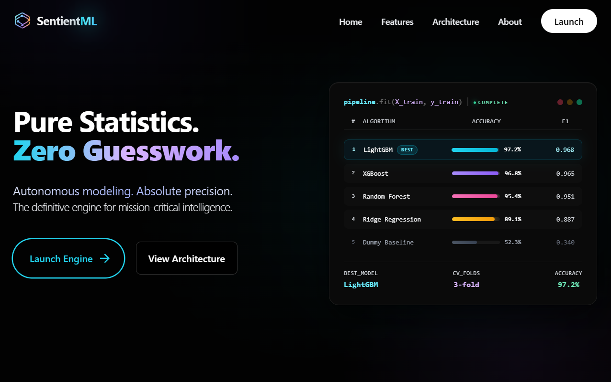

<p align="center">
  <picture>
    <source media="(prefers-color-scheme: dark)" srcset="banner-dark.svg">
    <source media="(prefers-color-scheme: light)" srcset="banner-light.svg">
    
  </picture>
</p>

<p align="center">
  
  
  
  
</p>
<p align="center">
  <em>Architecture & Documentation — SentientML Autonomous Intelligence Platform</em>
</p>

<p align="center">
  Proprietary source and autonomous ML pipeline logic are maintained in a <strong>private repository</strong>.<br>
  <em>Technical review access is granted to verified recruiters and hiring managers upon request.</em>
</p>
<p align="center">
  <a href="https://sentientml.site"><strong>Live Demo</strong></a> • 
  <a href="mailto:hello@rajaharis.com"><strong>Request Code Access</strong></a> •
  <a href="https://www.rajaharis.com"><strong>Portfolio</strong></a>
</p>

---

<p align="center">
  <strong>Autonomous ML engine for high-fidelity predictive orchestration.</strong><br>
  7-phase Bayesian-tuned pipeline for production-grade models with zero manual intervention.
</p>

<p align="center">
  
</p>
<p align="center">
  
  
  
  
  
</p>

---

## What This Is

**SentientML** is a full-stack, autonomous machine learning platform that takes a raw dataset (CSV, Excel, JSON, or TSV) and produces production-ready predictive models — with no manual configuration, no hyperparameter guessing, and no data science expertise required.

It implements a **7-phase pipeline** that handles every step from data profiling to deployment-ready API generation. Under the hood, it runs a **5-algorithm tournament** (LightGBM, XGBoost, Random Forest, Linear, Dummy baseline), tunes the champion with **Bayesian optimization (Optuna TPE)**, and optionally builds a **Stacking Ensemble** when model diversity is sufficient.

Every decision — which scaler per feature, which imputation strategy, whether to apply SMOTE, how many Optuna trials to run — is made autonomously based on the statistical properties of the incoming data.

---

## Architecture

### System Overview

```mermaid
flowchart LR
    User["User"] <==> FE

    subgraph FE["Frontend -- Next.js 15 / React 19 / TypeScript"]
        direction TB
        Landing["Landing Page"]
        Dash["Dashboard Hub"]
        Steps["7 Pipeline Components"]
    end

    FE <-->|"REST + Polling"| BE

    subgraph BE["Backend -- FastAPI 0.115"]
        direction TB
        EP["12 REST Endpoints"]
        BG["Background Thread Training"]
        SM["Session Manager + TTL + Memory Guard"]
    end

    BE <--> ENG

    subgraph ENG["ML Engine -- Python 3.11"]
        direction TB
        DA["data_analyzer.py"]
        PP["ml_pipeline.py -- 3500 lines"]
        MS["model_selector.py"]
        UT["utils.py -- Memory Engine"]
    end

    ENG --> OUT

    subgraph OUT["Output"]
        PRED["Live Predictions + Confidence"]
        ZIP["Self-Contained ZIP Bundle"]
    end

    classDef feNode fill:#0f172a,color:#e2e8f0,stroke:#22d3ee,stroke-width:2px
    classDef beNode fill:#0f172a,color:#e2e8f0,stroke:#a78bfa,stroke-width:2px
    classDef engNode fill:#0f172a,color:#e2e8f0,stroke:#fb923c,stroke-width:2px
    classDef outNode fill:#0f172a,color:#e2e8f0,stroke:#34d399,stroke-width:2px
    classDef userNode fill:#0f172a,color:#22d3ee,stroke:#22d3ee,stroke-width:2px

    class User userNode
    class Landing,Dash,Steps feNode
    class EP,BG,SM beNode
    class DA,PP,MS,UT engNode
    class PRED,ZIP outNode
```



### Pipeline Intelligence Flow

Every diamond is a real conditional branch in the codebase. Every rectangle is a real function call. Nothing is aspirational.

```mermaid
flowchart TD
    %% ═══ PHASE 1: UPLOAD ═══
    IN["File Upload -- CSV / Excel / JSON / TSV"]:::ph1
    IN --> PARSE["parse_file -- Pandas reader<br/>dirty null normalization<br/>NA, N-A, null, ?, whitespace to NaN"]:::ph1
    PARSE --> PROFILE["calculate_column_stats<br/>dtype, missing pct, skewness,<br/>unique count, ID detection"]:::ph1
    PROFILE --> RESP1["ProfileResponse<br/>session_id + column_stats"]:::ph1

    %% ═══ PHASE 2: TARGET ═══
    RESP1 --> TSEL["User selects target column"]:::ph2
    TSEL --> PTYPE["detect_problem_type<br/>cardinality, dtype, uniqueness ratio"]:::ph2
    PTYPE --> PTDEC{"Classification<br/>or Regression?"}:::dec
    PTDEC -->|"Low-cardinality int<br/>or categorical"| CLS["Classification"]:::ph2
    PTDEC -->|"Continuous float<br/>or high-cardinality int"| REG["Regression"]:::ph2
    CLS --> TVAL["Validate target<br/>distribution + missing"]:::ph2
    REG --> TVAL

    %% ═══ PHASE 3: ANALYSIS ═══
    TVAL --> ANALYZE["IntelligentDataAnalyzer.analyze"]:::ph3
    ANALYZE --> NORM["Normality Tests<br/>Shapiro-Wilk + Anderson-Darling"]:::ph3
    ANALYZE --> CORR["Correlation Analysis<br/>Pearson + Spearman matrices"]:::ph3
    ANALYZE --> VIFN["VIF Multicollinearity<br/>Variance Inflation Factor"]:::ph3
    ANALYZE --> CHI["Chi-Squared Independence<br/>Cramers V effect size"]:::ph3
    ANALYZE --> ANV["ANOVA / Kruskal-Wallis<br/>feature-target association"]:::ph3
    ANALYZE --> MIF["Mutual Information<br/>non-linear signal scoring"]:::ph3
    ANALYZE --> BAL["Class Balance Check<br/>imbalance ratio detection"]:::ph3

    NORM --> QS["100-pt Data Quality Score<br/>missing + dupes + outliers +<br/>feature health + target health"]:::ph3
    CORR --> QS
    VIFN --> QS
    CHI --> QS
    ANV --> QS
    MIF --> QS
    BAL --> QS
    QS --> QGATE{"Quality score<br/>at least 50?"}:::dec
    QGATE -->|"No"| FAIL["Hard Fail -- Dataset too noisy"]:::err
    QGATE -->|"Yes"| PP_START["Begin Preprocessing"]:::ph4

    %% ═══ PHASE 4: PREPROCESSING ═══
    %% Order matches ml_pipeline.py preprocess() exactly

    PP_START --> TCLEAN["Target cleaning<br/>drop NaN/Inf target rows"]:::ph4
    TCLEAN --> TCAP{"Regression AND<br/>target skew above 1.5?"}:::dec
    TCAP -->|"Yes"| TCLIP["Target Winsorization<br/>clip 1st/99th percentile"]:::ph4
    TCAP -->|"No"| DEDUP
    TCLIP --> DEDUP

    DEDUP["Duplicate row removal<br/>+ Inf-to-NaN conversion"]:::ph4

    DEDUP --> DATEC{"Date columns<br/>detected?"}:::dec
    DATEC -->|"Yes"| DATE_EX["Extract year / month<br/>day_of_week / day_of_month"]:::ph4
    DATEC -->|"No"| DROP1
    DATE_EX --> DROP1

    DROP1["Drop ID columns<br/>+ zero-variance features<br/>+ high-missing above 70 pct"]:::ph4

    DROP1 --> MC{"Multicollinear<br/>pairs r above 0.95?"}:::dec
    MC -->|"Yes"| MC_DROP["Drop redundant feature"]:::ph4
    MC -->|"No"| ZS
    MC_DROP --> ZS

    ZS{"Zero-signal features?<br/>MI bottom 10th percentile"}:::dec
    ZS -->|"Yes"| ZS_DROP["Drop noise features"]:::ph4
    ZS -->|"No"| MISSC
    ZS_DROP --> MISSC

    MISSC{"Features with<br/>15-70 pct missing?"}:::dec
    MISSC -->|"Yes"| MISS_IND["Add binary<br/>_was_missing indicators"]:::ph4
    MISSC -->|"No"| BOOL
    MISS_IND --> BOOL

    BOOL["Boolean to int conversion<br/>Mixed-type coercion"]:::ph4

    BOOL --> FEAT_LOOP["Per-Feature Processing Loop"]:::ph4

    %% Per-feature decisions
    FEAT_LOOP --> IMP{"Skewness<br/>above 1.0?"}:::dec
    IMP -->|"Yes"| IMP_MED["Median imputation<br/>outlier-resistant"]:::ph4
    IMP -->|"No"| IMP_MEAN["Mean imputation<br/>Gaussian-optimal"]:::ph4

    IMP_MED --> SCALEC
    IMP_MEAN --> SCALEC

    SCALEC{"Outliers<br/>above 2 pct?"}:::dec
    SCALEC -->|"Yes"| ROBUST["RobustScaler + Winsorization<br/>1st/99th pctl clipping"]:::ph4
    SCALEC -->|"No"| STANDARD["StandardScaler<br/>z-score normalization"]:::ph4

    ROBUST --> SKEWC
    STANDARD --> SKEWC

    SKEWC{"Skewness<br/>above 2.0?"}:::dec
    SKEWC -->|"Yes"| YJ["Yeo-Johnson power transform<br/>normalize distribution"]:::ph4
    SKEWC -->|"No"| RAREC
    YJ --> RAREC

    RAREC{"Rare categories<br/>below 1 pct freq?"}:::dec
    RAREC -->|"Yes"| MERGEC["Merge into _Other"]:::ph4
    RAREC -->|"No"| INTERACTC
    MERGEC --> INTERACTC

    INTERACTC{"2+ numeric features<br/>AND 100+ rows?"}:::dec
    INTERACTC -->|"Yes"| INT_FEAT["Interaction features<br/>top-6 correlated pairs, cap at 3"]:::ph4
    INTERACTC -->|"No"| ENCODE
    INT_FEAT --> ENCODE

    ENCODE["Encoding<br/>OneHot for low cardinality<br/>TargetEncoder for high cardinality"]:::ph4

    ENCODE --> CLUSTC{"200+ rows AND<br/>3+ mean-imputed cols?"}:::dec
    CLUSTC -->|"Yes"| KMEANS["KMeans cluster distances<br/>via FeatureUnion in sklearn Pipeline"]:::ph4
    CLUSTC -->|"No"| TTRANS
    KMEANS --> TTRANS

    TTRANS{"Regression target<br/>skew above 1.5?"}:::dec
    TTRANS -->|"Positive values + skew above 1.5"| LOG1P["log1p target transform"]:::ph4
    TTRANS -->|"Mixed values + skew above 1.0"| YJTAR["Yeo-Johnson target transform"]:::ph4
    TTRANS -->|"No"| SPLITC
    LOG1P --> SPLITC
    YJTAR --> SPLITC

    SPLITC["Train/Test Split<br/>stratified for classification<br/>10-25 pct test, dynamic by size"]:::ph4

    SPLITC --> VT["Variance Threshold 0.01<br/>drop near-constant features"]:::ph4

    VT --> PCAC{"Above 50 features<br/>AND above 100 samples?"}:::dec
    PCAC -->|"Yes"| PCA_DO["PCA -- retain 95 pct variance"]:::ph4
    PCAC -->|"No"| FSEL
    PCA_DO --> FSEL

    FSEL{"Features above<br/>samples / 10?"}:::dec
    FSEL -->|"Yes"| ANOVA_MI["Hybrid ANOVA + Mutual Information<br/>union of top-k, ranked by combined score"]:::ph4
    FSEL -->|"No"| RETAIN["All features retained"]:::ph4
    ANOVA_MI --> TR_START
    RETAIN --> TR_START

    %% ═══ PHASE 5: TRAINING ═══
    TR_START["Begin Training"]:::ph5
    TR_START --> MEMBUD["Runtime Memory Probe<br/>per-session budget calculation<br/>full / standard / compact tier"]:::ph5

    MEMBUD --> SMOTE_CHK{"Classification AND<br/>imbalance above 3 to 1<br/>AND minority below 30 pct?"}:::dec
    SMOTE_CHK -->|"Yes"| SMOTE_DO["SMOTE -- synthetic<br/>minority oversampling"]:::ph5
    SMOTE_CHK -->|"No"| DYN_CV
    SMOTE_DO --> DYN_CV

    DYN_CV["Dynamic CV Folds<br/>50 rows=2F / 500=3F / 5K=5F / 5K+=3F"]:::ph5

    DYN_CV --> SCREEN["Phase 1: Tournament Screening<br/>5-model CV on subsample<br/>LightGBM, XGBoost, RF, Linear, Dummy"]:::ph5

    SCREEN --> RANK["Rank by CV score<br/>select single champion<br/>dummy baseline comparison"]:::ph5

    RANK --> EFFORT{"Score Landscape<br/>Analysis"}:::dec
    EFFORT -->|"above 0.95 + gap above 0.40"| UFT["ultra_fast_track<br/>0 Optuna trials"]:::ph5
    EFFORT -->|"above 0.92 + gap above 0.30"| FT["fast_track<br/>3 trials"]:::ph5
    EFFORT -->|"above 0.85 + spread below 0.03"| CONV["converged<br/>5 trials"]:::ph5
    EFFORT -->|"below 0.60 or gap below 0.05"| LOW["low_signal<br/>3 trials"]:::ph5
    EFFORT -->|"below 0.75 with room"| DEEP["deep_effort<br/>up to 12 trials"]:::ph5
    EFFORT -->|"0.75-0.85 standard"| STD["standard<br/>8-10 trials"]:::ph5

    UFT --> TUNE_EXEC
    FT --> TUNE_EXEC
    CONV --> TUNE_EXEC
    LOW --> TUNE_EXEC
    DEEP --> TUNE_EXEC
    STD --> TUNE_EXEC

    TUNE_EXEC["Phase 2: Optuna TPE<br/>Bayesian optimization<br/>champion model only"]:::ph5

    TUNE_EXEC --> ENS_GATE{"skip_ensemble is false<br/>AND score spread above 0.02<br/>AND below 10K rows?"}:::dec
    ENS_GATE -->|"Yes"| STACKC["Stacking Ensemble<br/>top-3 models + meta-learner<br/>LogReg or Ridge"]:::ph5
    ENS_GATE -->|"No"| BEST
    STACKC --> BEST

    BEST["Select Best Model<br/>champion vs ensemble<br/>underfitting detection vs Dummy"]:::ph5

    %% ═══ PHASE 6: EVALUATION ═══
    BEST --> EVAL["Compute Metrics"]:::ph6

    EVAL --> MET_C["Classification Metrics<br/>F1, Accuracy, Balanced Acc<br/>Precision, Recall, MCC<br/>Cohens Kappa, Log Loss"]:::ph6
    EVAL --> MET_R["Regression Metrics<br/>R2, Adjusted R2, RMSE<br/>MAE, Median AE, NRMSE<br/>Explained Variance"]:::ph6

    MET_C --> FI
    MET_R --> FI

    FI["Feature Importance<br/>tree importances or coefficients"]:::ph6

    FI --> SHAP_CHK{"Model type?"}:::dec
    SHAP_CHK -->|"Has feature_importances_"| SHAP_T["TreeExplainer -- TreeSHAP<br/>game-theoretic values"]:::ph6
    SHAP_CHK -->|"Has coef_"| SHAP_L["LinearExplainer -- LinearSHAP<br/>coefficient attribution"]:::ph6
    SHAP_CHK -->|"Neither"| PERM
    SHAP_T --> PERM
    SHAP_L --> PERM

    PERM["Permutation Importance<br/>model-agnostic, 3 repeats"]:::ph6

    PERM --> LC["Learning Curves<br/>30 pct / 60 pct / 100 pct data"]:::ph6
    LC --> AB["A/B Model Comparison<br/>all trained models on test set"]:::ph6
    AB --> INSIGHTS["Metric Insights<br/>overfitting / underfitting /<br/>imbalance / tradeoff detection"]:::ph6

    INSIGHTS --> GEN{"Generalization<br/>Status Check"}:::dec
    GEN -->|"No issues"| GEN_OK["Robust Intelligence"]:::success
    GEN -->|"Overfitting detected"| GEN_WARN["Overfitting Warning"]:::warn
    GEN -->|"High severity"| GEN_ATT["Needs Attention"]:::warn

    %% ═══ PHASE 7: EXPORT ═══
    GEN_OK --> EXPORTC
    GEN_WARN --> EXPORTC
    GEN_ATT --> EXPORTC

    EXPORTC["Phase 7: Prediction + Export"]:::ph7
    EXPORTC --> LIVE["Live Prediction<br/>confidence scores +<br/>top-3 feature contributions"]:::ph7
    EXPORTC --> BUNDLE["Generate ZIP Bundle"]:::ph7
    BUNDLE --> B_APP["app.py -- FastAPI server<br/>predict + predict-batch + health"]:::ph7
    BUNDLE --> B_CLI["predict.py -- CLI script<br/>single + CSV batch mode"]:::ph7
    BUNDLE --> B_DOCK["Dockerfile<br/>containerized deployment"]:::ph7
    BUNDLE --> B_MODEL["model.joblib -- trained model<br/>preprocessor + all transformers"]:::ph7

    %% ═══ STYLES ═══
    classDef ph1 fill:#164e63,color:#cffafe,stroke:#22d3ee,stroke-width:2px
    classDef ph2 fill:#1e3a5f,color:#bfdbfe,stroke:#60a5fa,stroke-width:2px
    classDef ph3 fill:#4c1d95,color:#e9d5ff,stroke:#a78bfa,stroke-width:2px
    classDef ph4 fill:#312e81,color:#c7d2fe,stroke:#818cf8,stroke-width:2px
    classDef ph5 fill:#78350f,color:#fed7aa,stroke:#fb923c,stroke-width:2px
    classDef ph6 fill:#064e3b,color:#a7f3d0,stroke:#34d399,stroke-width:2px
    classDef ph7 fill:#713f12,color:#fef08a,stroke:#facc15,stroke-width:2px
    classDef dec fill:#1e1b4b,color:#fef3c7,stroke:#f59e0b,stroke-width:2.5px
    classDef err fill:#7f1d1d,color:#fca5a5,stroke:#ef4444,stroke-width:2px
    classDef success fill:#052e16,color:#86efac,stroke:#22c55e,stroke-width:2px
    classDef warn fill:#451a03,color:#fdba74,stroke:#f97316,stroke-width:2px
```



---

## The 7-Phase Pipeline

Each phase maps to a dedicated backend endpoint and a frontend component:

| Phase | What Happens | Backend | Frontend Component |
|:---:|:---|:---|:---|
| **1** | **Upload** — Parses CSV/Excel/JSON/TSV, normalizes dirty nulls (`?`, `N/A`, `#N/A`, etc.), profiles every column | `POST /api/upload` | `UploadStep.tsx` |
| **2** | **Target Selection** — Auto-detects classification vs regression with confidence scoring, validates target integrity | `POST /api/set-target` | `TargetSelectionStep.tsx` |
| **3** | **Statistical Analysis** — Runs Shapiro-Wilk / Anderson-Darling normality tests, Pearson & Spearman correlations, VIF multicollinearity analysis, Chi-squared independence tests with Cramér's V, ANOVA / Kruskal-Wallis, mutual information scoring | `POST /api/analyze` | `StatisticalAnalysisStep.tsx` |
| **4** | **Preprocessing** — Adaptive per-feature scaling (Robust vs Standard), stat-driven imputation (median for skewed, mean for Gaussian), Yeo-Johnson power transforms, OneHot / TargetMean encoding, interaction feature generation, rare category merging, date feature extraction, PCA dimensionality reduction, ANOVA+MI hybrid feature selection | `POST /api/preprocess` | `PreprocessingStep.tsx` |
| **5** | **Training** — 5-model tournament screening → single-champion Optuna TPE deep tuning → optional Stacking Ensemble. SMOTE is gated to >3:1 class imbalance. Adaptive compute allocation decides tuning depth based on score landscape. | `POST /api/train` | `TrainingStep.tsx` |
| **6** | **Evaluation** — Full metric suite (F1, Accuracy, MCC, Cohen's Kappa, R², RMSE, NRMSE, etc.), TreeSHAP and Permutation Importance explainability, learning curve analysis, A/B model comparison, overfitting/underfitting diagnostics | `POST /api/evaluate` | `EvaluationStep.tsx` |
| **7** | **Prediction & Export** — Live single/batch prediction with confidence scores, downloadable self-contained ZIP with FastAPI server, CLI script, Dockerfile, and dynamic README — **zero SentientML dependencies** | `POST /api/predict` | `PredictionStep.tsx` |

---

## Engineering Decisions

These are the non-obvious design decisions that define the system. Each is implemented in code, not aspirational.

**Per-Feature Adaptive Scaling** — Scaling is applied per-column, not globally. Features with >2% outliers get `RobustScaler` (IQR-based); normally distributed features get `StandardScaler`. This prevents a single outlier-heavy feature from distorting all others. → `ml_pipeline.py:586-612`

**Two-Phase Tournament Architecture** — Phase 1 screens all 5 algorithms with fast cross-validation on a subsample. Only the single champion advances to Phase 2 (Optuna TPE). This avoids wasting compute on deep-tuning models that already lost the screening round. → `ml_pipeline.py:1922-2371`

**Adaptive Compute Allocation** — The system analyzes the score landscape after screening and dynamically adjusts Phase 2 effort. If the champion already scores >0.95 with a massive baseline gap, it triggers a 0-trial fast-track bypass. If the signal is weak, it activates full 12-trial deep optimization. Six distinct effort tiers exist. → `ml_pipeline.py:2058-2126`

**SMOTE Gating** — Synthetic oversampling is strictly gated to classification datasets where `imbalance_ratio > 3:1` (from the data analyzer) AND `minority_pct < 30%` (from the training phase). This prevents SMOTE from degrading balanced datasets while automatically handling the minority-class problem when it exists. → `data_analyzer.py:418`, `ml_pipeline.py:1751-1776`

**Stacking Ensemble with Diversity Gate** — A `StackingClassifier`/`StackingRegressor` using a meta-learner (LogisticRegression / Ridge) is built from the top-3 screened models — but only when score spread exceeds 0.02 AND the dataset has <10K rows AND time budget permits. This prevents pointless ensembles when all models converge. → `ml_pipeline.py:2502-2622`

**Self-Contained Inference Export** — The downloadable ZIP requires zero SentientML dependencies. It dynamically generates a Pydantic-validated FastAPI server (`app.py`), a CLI prediction script (`predict.py`), and a `Dockerfile` — all parameterized by the specific feature schema and model type of the trained model. → `main.py:382-836`

**Quality-Score Hard Fail** — The data analyzer computes a continuous 100-point quality score with penalties for missing values, duplicates, feature health, outlier severity, target imbalance, and sample size. Datasets scoring below 50 trigger a hard fail to prevent garbage-in-garbage-out. → `data_analyzer.py:426-559`

**Autonomous Memory Management** — The system probes real available system memory at runtime, tracks concurrent session count, and dynamically computes per-session training budgets (max rows, tuning iterations, CV folds). Session TTL and eviction policies prevent OOM on shared infrastructure. → `utils.py:81-212`

---

## Feature Engineering (Automated)

These Kaggle-tier techniques are applied autonomously based on data characteristics:

| Technique | Trigger Condition | Implementation |
|:---|:---|:---|
| **Interaction Features** | ≥2 numeric features, ≥100 rows | Multiplicative interactions from top-6 target-correlated pairs (capped at 3) |
| **Date Feature Extraction** | Date column detected | Extracts year, month, day_of_week, day_of_month; drops original |
| **Missing Value Indicators** | 15–70% missing in a feature | Binary `_was_missing` flag — missingness pattern is often predictive |
| **Rare Category Merging** | Categories with <1% frequency | Merged into `_Other` to prevent sparse OHE columns |
| **KMeans Cluster Features** | >200 rows, ≥3 numeric features | Adds cluster distance features from unsupervised clustering |
| **Zero-Signal Feature Removal** | Mutual information ≈ 0 | Drops bottom-10th-percentile MI features to reduce noise |
| **Multicollinearity Reduction** | Pearson r > 0.95 | Drops redundant features from highly correlated pairs |
| **Target Transformation** | Regression target with skew > 1.5 | Log1p (positive targets) or Yeo-Johnson (general) |
| **PCA Compression** | >50 features after encoding | Retains 95% variance, reduces dimensionality |

---

## Tech Stack

### Frontend
| Tech | Version | Role |
|------|---------|------|
| Next.js | 15.1.4 | App Router framework |
| React | 19.0.0 | Functional UI components |
| TypeScript | 5.7.2 | Type safety |
| Tailwind CSS | 3.4.17 | Utility-first styling |
| Framer Motion | 12.34.2 | Animations |
| Recharts | 2.15.0 | Statistical visualization |

### Backend
| Tech | Version | Role |
|------|---------|------|
| FastAPI | 0.115.0 | Async REST framework |
| Scikit-Learn | 1.5.2 | ML algorithms, preprocessing, evaluation |
| XGBoost | ≥2.0.0 | Gradient boosting (L1/L2 regularization) |
| LightGBM | ≥4.0.0 | Leaf-wise gradient boosting |
| Optuna | ≥3.0.0 | Bayesian hyperparameter optimization (TPE sampler) |
| SHAP | ≥0.44.0 | Game-theoretic model explainability (TreeSHAP) |
| Pandas | 2.2.3 | Data manipulation |
| imbalanced-learn | ≥0.12.0 | SMOTE class balancing |

---

## API Reference

All endpoints are REST. Training runs asynchronously in a background thread and is polled via `/api/train-status`.

| Method | Endpoint | Description |
|:---|:---|:---|
| `POST` | `/api/upload` | Upload dataset (CSV, Excel, JSON, TSV). Returns column profiles. |
| `POST` | `/api/set-target` | Set target column. Returns problem type + confidence. |
| `POST` | `/api/analyze` | Run statistical analysis (normality, correlation, VIF, chi-squared). |
| `POST` | `/api/preprocess` | Execute intelligent preprocessing with full decision tracking. |
| `POST` | `/api/train` | Start background model training. Returns immediately. |
| `GET` | `/api/train-status/{id}` | Poll training progress (screening scores, Optuna trials, champion). |
| `POST` | `/api/evaluate` | Evaluate best model (metrics, SHAP, permutation importance, learning curves). |
| `GET` | `/api/features/{id}` | Get expected feature schema for predictions. |
| `POST` | `/api/predict/{id}` | Single/batch prediction with confidence scores. |
| `GET` | `/api/download-api-bundle/{id}` | Download self-contained deployment ZIP. |
| `POST` | `/api/cancel/{id}` | Cancel a running pipeline. |
| `DELETE` | `/api/session/{id}` | Clean up session and free memory. |

---

## Project Structure

```
sentientML/
├── backend/
│   ├── data_analyzer.py                   # Statistical profiling & analytics
│   ├── main.py                            # FastAPI server & session management
│   ├── ml_pipeline.py                     # Core ML engine (3500+ lines)
│   ├── model_selector.py                  # 5-algorithm tournament logic
│   ├── requirements.txt                   # Python dependencies
│   ├── schemas.py                         # Pydantic request/response models
│   └── utils.py                           # Memory engine & problem detection
├── frontend/
│   ├── app/                               # Next.js App Router
│   │   ├── dashboard/page.tsx             # ML pipeline orchestration hub
│   │   ├── globals.css                    # Design system tokens
│   │   ├── layout.tsx                     # Root layout & metadata
│   │   └── page.tsx                       # Landing page
│   ├── components/
│   │   ├── workflow/                      # 7 pipeline phase components
│   │   │   ├── visual/                    # Statistical visualization logic
│   │   │   ├── EvaluationStep.tsx
│   │   │   ├── PredictionStep.tsx
│   │   │   ├── PreprocessingStep.tsx
│   │   │   ├── StatisticalAnalysisStep.tsx
│   │   │   ├── TargetSelectionStep.tsx
│   │   │   ├── TrainingStep.tsx
│   │   │   └── UploadStep.tsx
│   │   └── ui/                            # Shared design components
│   │       ├── AnimatedButton.tsx
│   │       └── StepLoader.tsx
│   ├── lib/
│   │   ├── api.ts                         # Axios client & backend bridge
│   │   └── utils.ts                       # Tailwind/Utility helpers
│   ├── public/                            # Static branding assets
│   ├── types/
│   │   └── index.ts                       # Shared TypeScript definitions
│   ├── .env.example                       # Environment setup template
│   ├── next.config.js                     # Next.js configuration
│   ├── package.json                       # Frontend dependencies & scripts
│   ├── tailwind.config.js                 # Styling architecture
│   └── tsconfig.json                      # TypeScript configuration
├── .gitignore                             # Version control exclusions
├── LICENSE                                # Proprietary License
├── README.md                              # Documentation
└── SentientML.png                         # Project banner
```

---

## Codebase Scale

| Component | Lines&nbsp;of&nbsp;Code | Description |
|:---|---:|:---|
| `ml_pipeline.py` | 3,500+ | Preprocessing, training, evaluation, prediction, model export |
| `data_analyzer.py` | 796 | Statistical tests, quality scoring, feature insights |
| `main.py` | 933 | FastAPI endpoints, session management, background training |
| `utils.py` | 580 | Memory engine, file parsing, problem type detection |
| `model_selector.py` | 260 | Algorithm catalog, parameter spaces, model instantiation |
| `schemas.py` | 231 | Pydantic validation schemas |
| **Frontend** (7 pipeline components) | ~340K bytes | Full dashboard with real-time training visualizations |

---

## License

**Proprietary — All Rights Reserved.**
Copyright © 2026 Raja Haris. Access is granted exclusively for technical evaluation and recruitment review. All other uses are strictly prohibited. See [LICENSE](./LICENSE).

---

<p align="center">
  <br />
  
  <br />
  <a href="mailto:hello@rajaharis.com"><strong>Email Inquiry</strong></a> • 
  <a href="https://www.rajaharis.com"><strong>Official Portfolio</strong></a> 
</p>
